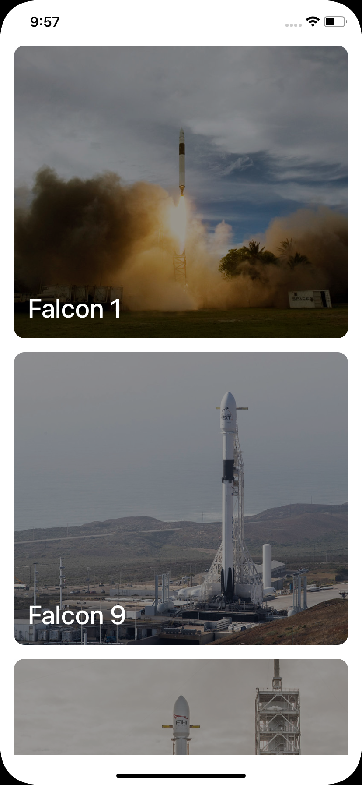

# SpaceX

An iOS application to display all SpaceX rockets. No 3rd-party library required.

    

## Learning map

- [x] UI Development
- [x] Networking
- [ ] Unit Test
- [ ] UI Test

## License

MIT License

Copyright (c) 2019 Victor Shinya
